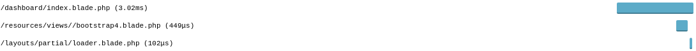

**Laravel Debugbar Measure Views**

This package simply wrap any `View\Engine::get()` calls into `Debugbar::measure()` function. 
This will give you the time tracking of your views generation in your debugbar timeline as:

